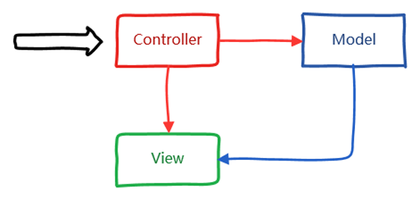
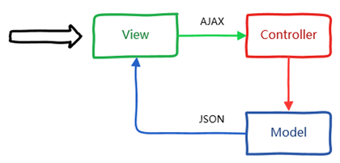

# 从MVC到前后端分离

	MVC是一种经典的设计模式，全名为Model-View-Controller，即模型-视图-控制器。

	其中，模型是用于封装数据的载体，例如，在Java中一般通过一个简单的POJO（Plain Ordinary Java Object）来表示，其本质是一个普通的Java Bean，包含一系列的成员变量及其getter/setter方法。对于视图而言，它更加偏重于展现，也就是说，视图决定了界面到底长什么样子，在Java中可通过JSP来充当视图，或者通过纯HTML的方式进行展现，而后者才是目前的主流。模型和视图需要通过控制器来进行粘合，例如，用户发送一个HTTP请求，此时该请求首先会进入控制器，然后控制器去获取数据并将其封装为模型，最后将模型传递到视图中进行展现。

综上所述，MVC的交互过程如图1所示。

### **MVC模式的优点与不足**

	MVC模式早在上个世纪70年代就诞生了，直到今天它依然存在，可见生命力相当之强。MVC模式最早用于Smalltalk语言中，最后在其它许多开发语言中都得到了很好的应用，例如，Java中的Struts、Spring MVC等框架。正是因为这些MVC框架的出现，才让MVC模式真正落地，让开发更加高效，让代码耦合度尽量减小，让应用程序各部分的职责更加清晰。

既然MVC模式这么好，难道它就没有不足的地方吗？MVC至少有以下三点不足：

1. 每次请求必须经过“控制器->模型->视图”这个流程，用户才能看到最终的展现的界面，这个过程似乎有些复杂。
2. 实际上视图是依赖于模型的，换句话说，如果没有模型，视图也无法呈现出最终的效果。
3. 渲染视图的过程是在服务端来完成的，最终呈现给浏览器的是带有模型的视图页面，性能无法得到很好的优化。

为了使数据展现过程更加直接，并且提供更好的用户体验，我们有必要对MVC模式进行改进。不妨这样来尝试，首先从浏览器发送AJAX请求，然后服务端接受该请求并返回JSON数据返回给浏览器，最后在浏览器中进行界面渲染。

改进后的MVC模式如图2所示。

 

也就是说，我们输入的是AJAX请求，输出的是JSON数据，市面上有这样的技术来实现这个功能吗？答案是REST。

> REST全称是Representational State Transfer（表述性状态转移），它是Roy Fielding博士在2000年写的一篇关于软件架构风格的论文，此文一出，威震四方！国内外许多知名互联网公司纷纷开始采用这种轻量级的Web服务，大家习惯将其称为RESTful Web Services，或简称REST服务。]

如果将浏览器这一端视为前端，而服务器那一端视为后端的话，可以将以上改进后的MVC模式简化为以下前后端分离模式，如图3所示。

 

